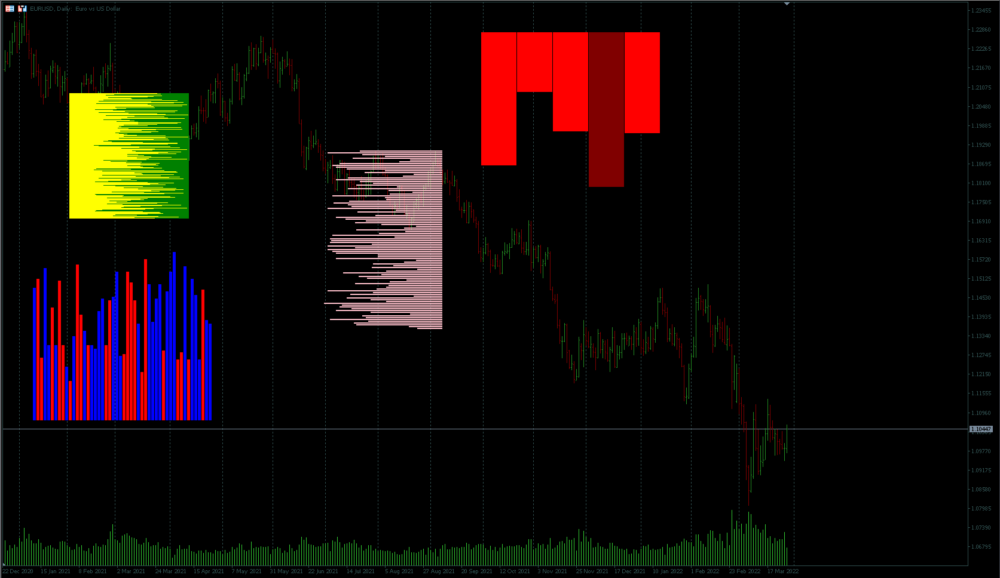

# VolumeProfile chart object

## Install

```bash
cd YourMT4(or5)/MQL4(or5)/Include/DS
git clone https://github.com/mql-systems/VolumeProfile_inc.git VolumeProfile
```

## Example



```mql5
#include <DS\VolumeProfile\VolumeProfile.mqh>

//--- global variables
VolumeProfile volumeProfile1;
VolumeProfile volumeProfile2;
VolumeProfile volumeProfile3;
VolumeProfile volumeProfile4;
VolumeProfile volumeProfile5;
VolumeProfile volumeProfile6;

int MathRandomBounds(int minVal, int maxVal)
{
   return int(minVal + MathRound((maxVal - minVal) * (MathRand() / 32767.0)));
}

int OnInit()
{
   // Example 1
   //------------
   VolumeProfileData volumeData1[250];
   
   volumeProfile1.Create(iTime(_Symbol,_Period,300), iHigh(_Symbol,_Period,300), 200, 210);
   volumeProfile1.Bg(ColorToARGB(clrGreen, 255));
   volumeProfile1.VolumeDistance(0);
   
   for (int i=0; i<250; i++)
   {
      volumeData1[i].volumeInPercent = MathRandomBounds(20,100);
      volumeData1[i].volumeClr       = ColorToARGB(clrYellow, 255);
   }
   
   volumeProfile1.VolumeSet(volumeData1);
   volumeProfile1.Redraw();
   
   
   // Example 2
   //------------
   VolumeProfileData volumeData2[50];
   
   volumeProfile2.Create(50, 400, 300, 300);
   volumeProfile2.VolumeDistance(1);
   volumeProfile2.Vertical(false);
   
   for (int i=0; i<50; i++)
   {
      volumeData2[i].volumeInPercent = MathRandomBounds(20,100);
      volumeData2[i].volumeClr       = (MathRand()%2==0) ? ColorToARGB(clrRed, 255) : ColorToARGB(clrBlue, 255);
   }
   
   volumeProfile2.VolumeSet(volumeData2);
   volumeProfile2.Redraw();
   
   
   // Example 3
   //------------
   VolumeProfileData volumeData3[100];
   
   volumeProfile3.Create(iTime(_Symbol,_Period,194), iHigh(_Symbol,_Period,194), 200, 300);
   volumeProfile3.VolumeDistance(1);
   volumeProfile3.DrawBack(true);
   
   for (int i=0; i<100; i++)
   {
      volumeData3[i].volumeInPercent = MathRandomBounds(20,100);
      volumeData3[i].volumeClr       = ColorToARGB(clrPink, 255);
   }
   
   volumeProfile3.VolumeSet(volumeData3);
   volumeProfile3.Redraw();
   
   
   // Example 4
   //------------
   VolumeProfileData volumeData4[10];
   
   volumeProfile4.Create(800, 50, 300, 600);
   volumeProfile4.VolumeDistance(1);
   volumeProfile4.Vertical(false);
   volumeProfile4.DrawBack(true);
   
   for (int i=0; i<10; i++)
   {
      volumeData4[i].volumeInPercent = MathRandomBounds(20,100);
      volumeData4[i].volumeClr       = (MathRand()%2==0) ? ColorToARGB(clrMaroon, 255) : ColorToARGB(clrRed, 255);
   }
   
   volumeProfile4.VolumeSet(volumeData4);
   volumeProfile4.Redraw();
   
   return INIT_SUCCEEDED;
}
```